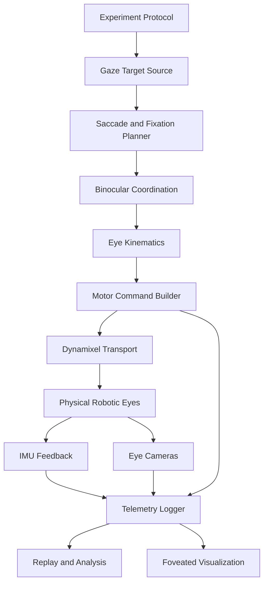

# Robotic Eye Architecture

## Overview

This project is a robotic-eye control and visualization platform for studying how
the visual scene changes during human-like eye motion. The central goal is not
only to move two artificial eyes, but to make the relationship between gaze,
saccades, fixation, camera input, and foveated perception visible and measurable.

The system should be understood as a layered robotics architecture:

```text
Experiment intent
  -> gaze target / saccade command
  -> binocular eye-motion planner
  -> eye kinematics and calibration
  -> motor command generation
  -> Dynamixel actuator transport
  -> physical eye motion
  -> IMU + camera feedback
  -> synchronized visualization and analysis
```

Current code already contains the main building blocks: joystick-driven gaze
commands, kinematic mapping from yaw/pitch/roll to cable or muscle pulses,
Dynamixel sync-write control, IMU feedback, ESP32 camera streaming, logging, and
offline plotting. This document makes those responsibilities explicit and defines
the architecture needed to support the next research goal: visualizing saccade
and foveation motion from the eye's own viewpoint.

## 1. System Goal

The system goal is to visualize what a moving eye "sees" during saccades and
fixations.

More specifically, the platform should:

- Reproduce gaze shifts that approximate human eye behavior, including fixation,
  fast saccadic motion, post-saccadic settling, and optional pursuit-like motion.
- Capture the camera view from each eye during those movements.
- Estimate the actual eye pose over time from IMU feedback and motor telemetry.
- Show how the scene moves across the image plane during a saccade.
- Provide a foveated view: high-detail information around the gaze center and
  lower-detail peripheral context around it.
- Log commands, measured motion, camera frames, and timing so that each run can
  be replayed, analyzed, and compared.

The research question can be stated as:

> When the robotic eye performs human-like gaze shifts, how does the visual input
> change over time, and how can that change be visualized as foveated perception?

This is different from a simple eye-motion demo. A simple demo asks, "Can the eye
move to a target?" This project asks, "What visual information is available
during that movement, and how does the system represent the difference between
fixation, saccade, and post-saccadic stabilization?"

### Design Priorities

- The visual output matters as much as the mechanical motion.
- The command path and sensing path must be synchronized.
- Gaze trajectories should be repeatable, not only manually controlled.
- Calibration must connect four spaces: motor ticks, eye pose, camera pixels,
  and visual/foveal coordinates.
- The architecture should support both online control and offline replay.

### Non-Goals

- The current system does not need to be a perfect biological model of the human
  retina, eye muscles, or neural control.
- The first version does not need a real-time neural vision model.
- The first version does not need perfect high-speed saccades if the camera,
  IMU, and motor rates limit the measurable bandwidth.

The correct first milestone is a synchronized, measurable, and visually clear
approximation of saccade/fixation/foveation behavior.

## 2. Hardware Overview

The physical platform is a binocular robotic-eye rig with two mechanically
actuated eyes.

### Robotic Eyes

- Two eyes: left and right.
- Each eye is controlled by six actuator channels that approximate extraocular
  muscle actions.
- The modeled muscle order is:
  - MR: medial rectus
  - LR: lateral rectus
  - SR: superior rectus
  - IR: inferior rectus
  - SO: superior oblique
  - IO: inferior oblique
- The eye geometry in the modular controller uses an eyeball radius of 15 mm.
- The kinematic layer converts desired yaw, pitch, and roll into actuator pulse
  differences using insertion points, pulley points, pulse scales, and offsets.

### Actuators

- The current controller targets 12 ROBOTIS Dynamixel XL330-M288-T servos, IDs
  1 through 12.
- IDs 1-6 correspond to the left eye; IDs 7-12 correspond to the right eye.
- Left eye IDs 1-6 map to LR, MR, SR, IR, SO, IO.
- Right eye IDs 7-12 map to MR, LR, SR, IR, SO, IO.
- The controller uses Dynamixel Protocol 2.0 at 1 Mbps.
- The default motor bus is configured as `COM12`.
- Motors are controlled in Extended Position Mode.
- Current code uses sync read for present position and sync write for goal
  position.
- Existing analysis scripts also read present current for estimating torque or
  cable force.
- The current reported power path is an external adapter feeding a U2D2 Power
  Hub Board, while the U2D2 provides USB-to-Dynamixel communication. The adapter
  was reported as 12 V / 5 A, but the actual XL330 bus voltage must be verified
  or regulated before operation.

### Sensors

- IMUs are used to estimate actual eye orientation.
- The IMU model is the Adafruit 9-DOF Absolute Orientation IMU Fusion Breakout -
  BNO055.
- The left IMU is currently mapped to `COM11`.
- The right IMU is currently mapped to `COM6`.
- IMU serial baud rate is 921600.
- The ESP32-S3 camera/IMU firmware uses a BNO055 IMU and currently emits IMU
  data at 20 Hz.

### Cameras

- Each eye can stream from an ESP32-S3-CAM Development Board with an OV3660
  camera, antenna, ESP32-S3 N16R8 module, 16 MB flash, and 8 MB PSRAM.
- Current default camera URLs are:
  - Left camera: `http://192.168.4.1/stream`
  - Right camera: `http://192.168.4.200/stream`
- Camera calibration files are stored under `calibration/camera_intrinsics/`.
- Camera intrinsics and distortion parameters are stored in `.npz` files.

### User Input and Host

- A joystick can provide manual target yaw/pitch commands.
- The host computer runs Python control scripts on Windows.
- Existing scripts use `pygame`, `dynamixel_sdk`, `serial`, `opencv-python`,
  `numpy`, `pandas`, `matplotlib`, `PIL`, and `tkinter`.

### Data Products

- Experiment datasets and analysis outputs are stored under `experiments/`.
- Generated videos are stored under `media/videos/`.
- Reusable calibration artifacts are stored under `calibration/`.

## 3. Software Architecture

The software should be organized around responsibility boundaries, not around
individual experiments. Each layer should have a clear input and output.



### Current Implementation Mapping

| Responsibility | Current Files |
| --- | --- |
| Demo entry points | `demos/` |
| Hardware constants and safety limits | `src/cable_driven_eye_robot/config.py` |
| Eye geometry and pulse computation | `src/cable_driven_eye_robot/kinematics.py` |
| Dynamixel sync read/write | `src/cable_driven_eye_robot/hardware/dynamixel.py` |
| Joystick input | `src/cable_driven_eye_robot/input_devices/joystick.py` |
| Shared math helpers | `src/cable_driven_eye_robot/math_utils.py` |
| Combined joystick, IMU, camera dashboard | `src/cable_driven_eye_robot/apps/dashboard_demo.py` |
| IMU feedback control | `src/cable_driven_eye_robot/control/feedback.py` |
| Open-loop control | `src/cable_driven_eye_robot/control/open_loop.py` |
| Camera calibration | `calibration/camera_intrinsics/` |
| ESP32 camera and IMU firmware | `firmware/esp32_imu_camera/IMUcamera.ino` |
| Binocular visualization outputs | `experiments/binocular_visualization/` |
| Offline videos and video processing | `media/videos/` |

### Recommended Target Architecture

The next refactor should separate the project into these conceptual modules:

- `experiment_protocols`: defines repeatable trials such as fixation, single
  saccade, multi-step scan path, pursuit, and replay.
- `gaze_sources`: joystick, scripted target sequence, recorded replay, visual
  target detector, or manual UI.
- `saccade_profiles`: converts target jumps into time-indexed gaze trajectories.
- `binocular_planner`: maps a desired gaze target into left-eye and right-eye
  target poses.
- `eye_kinematics`: converts eye pose into actuator pulse differences.
- `hardware`: owns Dynamixel transport, motor state, torque enable/disable, and
  reset.
- `sensors`: owns IMU readers, camera readers, timestamps, connection status,
  and calibration.
- `foveation`: converts gaze pose and camera frames into foveated visual output.
- `telemetry`: defines the logged data schema and writes synchronized CSV/video
  records.
- `visualization`: live dashboard, offline replay, plots, and presentation
  videos.

This separation matters because the same low-level eye controller should be
usable from a joystick, a scripted saccade experiment, a face/target tracker, or
an offline replay without rewriting motor code.

## 4. Data / Control Flow

The architecture has two important flows: the online control flow and the
offline analysis flow.

### Online Control Flow

```text
Target source
  -> desired gaze target
  -> saccade/fixation planner
  -> desired left/right eye pose
  -> yaw/pitch/roll with Listing roll
  -> muscle pulse differences
  -> absolute Dynamixel goal positions
  -> sync-write motor command
  -> physical eye motion
  -> IMU pose + camera frame + motor telemetry
  -> synchronized display and log
```

For joystick control, the target source is the joystick. For saccade
visualization, the target source should usually be a scripted experiment because
the motion must be repeatable.

### Offline Analysis Flow

```text
CSV telemetry + recorded camera/video
  -> timestamp alignment
  -> command vs actual pose comparison
  -> image-plane motion analysis
  -> foveated render generation
  -> plots, videos, and metrics
```

The offline path is important because camera, IMU, and motor data may run at
different rates. A replay pipeline can interpolate pose and align it with camera
frames more cleanly than the live dashboard can.

### Core Data Contracts

The system should converge around a small set of data types:

#### `GazeTarget`

Represents the high-level visual target.

```text
time_s
target_id
yaw_deg
pitch_deg
vergence_deg, optional
mode: fixation | saccade | pursuit | replay | manual
```

#### `EyePose`

Represents desired or measured eye orientation.

```text
time_s
side: left | right
yaw_deg
pitch_deg
roll_deg
source: command | imu | estimate
valid
```

#### `MotorCommand`

Represents the command sent to the actuator layer.

```text
time_s
motor_id
goal_position_ticks
goal_velocity, optional
goal_current, optional
profile_velocity
profile_acceleration
```

#### `FrameSample`

Represents a camera frame and its timing metadata.

```text
time_s
side: left | right
frame_index
image_width
image_height
camera_url
calibration_id
```

#### `TelemetrySample`

Represents one synchronized row for analysis.

```text
time_s
commanded_left_pose
commanded_right_pose
actual_left_pose
actual_right_pose
motor_positions
motor_currents
camera_frame_indices
experiment_stage
```

The current CSV files already contain many of these fields. The architectural
improvement is to make the schema intentional and consistent across experiments.

## 5. Module Responsibilities

### Experiment Layer

Responsible for deciding what the eye should do.

Examples:

- Hold center fixation for 1 s.
- Saccade 15 deg right in 150 ms.
- Hold fixation after the saccade for 1 s.
- Repeat the same command for five trials.
- Play a predefined scan path over a static scene.

This layer should not know about motor ticks, COM ports, or pulley geometry.

### Gaze Planner

Responsible for turning intent into a time-indexed gaze trajectory.

For saccades, this module should define:

- Start pose.
- End pose.
- Amplitude.
- Duration.
- Peak velocity.
- Acceleration and deceleration shape.
- Optional post-saccadic correction.
- Fixation duration before and after the movement.

The first implementation can use simple profiles such as minimum-jerk,
trapezoidal velocity, or a hand-tuned smooth step. Later versions can implement
human main-sequence-inspired relationships between amplitude, duration, and peak
velocity.

### Binocular Coordination

Responsible for producing left-eye and right-eye pose targets.

For most current experiments, both eyes can receive the same yaw/pitch target.
For more realistic visual behavior, this layer should support:

- Conjugate gaze: both eyes rotate in the same direction.
- Vergence: eyes rotate inward or outward for near/far targets.
- Per-eye calibration offsets.
- Per-eye motion limits.
- Optional suppression of one eye during monocular tests.

### Kinematics Layer

Responsible for mapping eye pose to actuator pulse differences.

Current implementation:

- `compute_listing_roll(x_deg, y_deg)` estimates roll from yaw/pitch.
- `compute_muscle_pulses(...)` rotates insertion points and computes muscle
  length changes relative to pulley points.
- Left and right geometries are built separately because the oblique muscles and
  sign conventions differ between eyes.

This layer should stay independent from Dynamixel transport. Its input should be
eye pose in degrees. Its output should be actuator deltas in ticks or normalized
muscle-length units.

### Actuator / Hardware Layer

Responsible for all Dynamixel communication and motor safety.

Current responsibilities include:

- Open/close the Dynamixel serial port.
- Set Extended Position Mode.
- Configure profile velocity and acceleration.
- Enable or disable torque.
- Sync-read present position.
- Sync-write goal position.
- Reset to calibrated perfect positions.
- Limit large jumps using `max_goal_step`.
- Unwrap multi-turn position targets near the previous goal.

No high-level experiment logic should live in this layer.

### Sensor Layer

Responsible for acquiring measured state.

IMU responsibilities:

- Open the left and right serial ports.
- Parse yaw, pitch, roll, angular velocity, angular acceleration, gyro, and
  linear acceleration when available.
- Apply zero calibration.
- Report connection status and sample age.

Camera responsibilities:

- Open left and right camera streams.
- Decode frames.
- Timestamp each frame.
- Apply camera intrinsics and distortion correction when needed.
- Report frame rate, dropped frames, and connection status.

### Foveation Layer

Responsible for converting camera frames and gaze state into a visualization of
foveated perception.

Initial foveation features:

- Mark the estimated gaze center in the camera image.
- Crop a high-resolution foveal window around the gaze center.
- Blur or downsample peripheral regions.
- Show the image-plane motion path during the saccade.
- Show before-saccade, during-saccade, and after-saccade frames side by side.

More advanced foveation features:

- Gaze-contingent resolution falloff.
- Motion blur or suppression during fast saccade phases.
- Stereo comparison between left and right eye views.
- Stabilized world view reconstructed from eye pose and camera frames.

### Telemetry and Logging Layer

Responsible for making experiments repeatable and analyzable.

Each run should log:

- Experiment name and trial number.
- Commanded gaze target.
- Active trajectory target at each timestep.
- Commanded left/right eye pose.
- Measured left/right IMU pose.
- Pose error.
- Motor goal positions.
- Motor present positions.
- Motor current, when available.
- Camera frame index or video timestamp.
- Loop timing and sensor ages.
- Safety events, resets, and dropped samples.

Logs should be written in a stable schema so that plotting scripts do not need
custom parsing for every experiment.

### Visualization Layer

Responsible for communicating the system behavior.

Live dashboard:

- Show commanded gaze.
- Show measured eye pose.
- Show left/right camera streams.
- Show connection health.
- Show recent errors and safety events.

Offline visualization:

- Plot target vs actual gaze.
- Plot yaw/pitch/roll error.
- Plot saccade duration, overshoot, and settling time.
- Render synchronized camera videos with gaze overlays.
- Render foveated videos showing high-detail center and low-detail periphery.

## 6. Timing and Control Loop

The project has multiple clocks:

- Motor command loop.
- IMU serial sampling.
- Camera frame sampling.
- Joystick polling.
- Visualization refresh.
- CSV/video logging.

These clocks should be treated separately and synchronized through timestamps.

### Current Timing

Existing code shows several timing regimes:

- The modular joystick loop sleeps for 0.002 s, which implies a target loop rate
  up to roughly 500 Hz if communication and computation allow it.
- Some feedback experiments use a 0.05 s loop period, or roughly 20 Hz.
- The ESP32 camera/IMU firmware sets the IMU interval to 50 ms, or 20 Hz.
- Dynamixel transport runs at 1 Mbps.
- Joystick command step limits are currently around 0.08 deg per loop for yaw
  and 0.06 deg per loop for pitch in the modular controller.

### Target Timing Architecture

The control loop should be designed as:

```text
high-rate motor command loop:
    consume latest desired trajectory pose
    compute motor goals
    write goals
    read available motor telemetry
    timestamp command and response

sensor loops:
    read IMU and camera at their own rates
    timestamp each sample immediately
    publish latest valid sample

visualization/logging loop:
    collect latest command, sensor, and frame samples
    align by timestamp
    display and write to disk
```

The motor command loop should not block on camera frame decoding. Camera frame
processing can be slower and asynchronous because foveation visualization is
allowed to lag slightly behind motor control.

### Saccade Trial Phases

A repeatable saccade experiment should use explicit stages:

1. `pre_fixation`: hold the start pose and collect baseline frames.
2. `saccade`: execute the planned rapid gaze transition.
3. `post_fixation`: hold the final pose and measure settling.
4. `return`: optionally return to center or the next start pose.
5. `complete`: stop motion, save logs, and render summary outputs.

Each logged row should include the current stage. This makes plots and videos
much easier to interpret.

### Latency Considerations

The key latency measurements are:

- Command generation to Dynamixel sync-write.
- Sync-write to measured IMU response.
- Camera exposure/readout to host timestamp.
- Camera frame timestamp to visualization display.
- Difference between commanded gaze center and displayed foveal center.

For the foveation goal, camera/pose synchronization is as important as raw motor
speed. A visually impressive demo can still be scientifically weak if the gaze
overlay and camera frame are not time-aligned.

## 7. Calibration Strategy

Calibration is the bridge between hardware motion and meaningful visual output.
The project needs calibration at several levels.

### Motor Zero / Perfect Position Calibration

Purpose:

- Define a repeatable neutral eye pose.
- Make motor commands relative to a known baseline.

Current implementation:

- `perfect_positions` are stored in configuration or experiment scripts.
- `reset_perfect()` sync-writes all motors to calibrated positions.
- The controller then reads present positions and updates the baseline.

Required improvement:

- Store each calibration as a named file with date, rig version, motor IDs, and
  notes.
- Avoid hard-coding different perfect positions across many experiment scripts.
- Record which calibration was used in every CSV log.

### Eye Geometry Calibration

Purpose:

- Map desired yaw/pitch/roll into actuator pulse changes.

Current implementation:

- Geometry is defined by insertion points, pulley points, pulse scales, and
  offsets in `kinematics.py`.

Required improvement:

- Fit pulse scales and offsets from measured motion data.
- Validate the model across a grid of commanded gaze targets.
- Store left and right eye geometry separately.
- Report expected vs measured yaw/pitch/roll error.

### IMU Calibration

Purpose:

- Convert raw IMU orientation into eye pose relative to the neutral pose.

Current implementation:

- Scripts zero IMU pose at startup or on command.
- Some scripts correct roll/camera zero offsets through helper functions.

Required improvement:

- Define a standard IMU coordinate convention.
- Record zero offsets in metadata.
- Track sample age and reject stale IMU data.
- Validate IMU pose against known commanded poses.

### Camera Intrinsic Calibration

Purpose:

- Correct lens distortion and make pixel measurements meaningful.

Current implementation:

- Checkerboard calibration scripts store camera matrix and distortion
  coefficients as `.npz` files.

Required improvement:

- Maintain separate calibration files for left and right cameras.
- Record image resolution and camera module identity.
- Apply undistortion before measuring pixel motion or foveal coordinates.

### Pixel-to-Gaze Calibration

Purpose:

- Map eye pose to image location.
- Identify where the foveal center should appear in each camera frame.

Required approach:

- Command the eye to a grid of yaw/pitch targets.
- Capture camera frames at each target.
- Detect a known visual marker or calibration target.
- Fit a mapping from `(yaw_deg, pitch_deg)` to `(u_px, v_px)`.
- Validate the mapping with held-out target points.

This calibration is essential for foveation. Without it, the system can show a
camera image, but it cannot confidently say where the gaze center is in that
image.

### Temporal Calibration

Purpose:

- Align motor commands, IMU samples, and camera frames.

Required approach:

- Timestamp commands and sensor samples with a common host clock.
- Estimate fixed camera delay if necessary.
- Use step or saccade events to align command onset with measured motion onset.
- Store measured delay values in the experiment metadata.

## 8. Safety Constraints

The system must protect both the hardware and the data quality.

### Motion Limits

Current limits include:

- Maximum yaw/pitch limits for joystick control.
- Deadband around joystick zero.
- Step limits for joystick command changes.
- Maximum pulse magnitude safety check.
- Maximum motor goal step in ticks.

These limits should remain active in all control modes, including scripted
saccades and replay.

### Torque and Reset Safety

The actuator layer should always support:

- Torque enable/disable.
- Reset to perfect positions.
- Reset to initial positions.
- Keyboard stop.
- Shutdown reset and torque disable.

If an exception occurs, the system should attempt to return to a safe state and
disable torque.

### Sensor Health

The system should detect:

- Missing IMU samples.
- Stale IMU data.
- Camera stream disconnects.
- Dropped camera frames.
- Dynamixel communication failures.
- Motor present position unavailable.

Safety behavior should be explicit. For example, if IMU feedback is stale during
a feedback-control trial, the controller should either hold the last safe command
or switch to open-loop mode with a logged warning.

### Mechanical Safety

Because the eyes are cable/muscle-like mechanisms, safety should also consider:

- Cable slack.
- Cable over-tension.
- Pulley interference.
- Unexpected sign inversion in one muscle group.
- Commanded positions outside the calibrated physical range.

The foveation visualization should never require unsafe motion. If the camera
view requires a larger visual angle than the robot can safely reach, the scene or
target arrangement should be changed instead of exceeding motion limits.

## 9. Testing and Success Criteria

Success should be measured at the system level, not only by whether the motors
move.

### Functional Tests

The system should pass these basic checks:

- Opens the Dynamixel port and configures all 12 motors.
- Reads present position from every motor.
- Resets both eyes to calibrated neutral pose.
- Accepts joystick or scripted target input.
- Computes left and right muscle pulses without exceeding safety limits.
- Opens both IMU streams.
- Opens both camera streams.
- Logs a complete CSV file for each experiment run.
- Generates an offline visualization from the logged data.

### Control Performance Metrics

For each saccade trial, measure:

- Commanded amplitude in degrees.
- Actual amplitude in degrees.
- Saccade duration.
- Peak angular velocity.
- Overshoot.
- Settling time.
- Final fixation error.
- RMS tracking error.
- Left/right eye mismatch.

Suggested initial success criteria:

- The system can execute repeatable commanded gaze shifts in yaw and pitch.
- Final fixation error is consistently small enough that the foveal crop lands
  near the intended target.
- Post-saccadic settling is visible and measurable rather than hidden.
- The same scripted trial produces similar target-vs-actual plots across
  repeated runs.

### Foveation / Visualization Metrics

For the main research goal, success means:

- The recorded camera view is synchronized with command and IMU data.
- The gaze center can be overlaid on the image.
- The foveal crop follows the estimated gaze center.
- A video can show pre-saccade, saccade, and post-saccade visual experience.
- The visualization makes clear how peripheral scene content shifts during the
  gaze transition.
- The project can compare commanded foveal center vs measured/estimated foveal
  center.

### Data Quality Metrics

Each experiment should report:

- Average loop period.
- Maximum loop period.
- IMU sample age.
- Camera FPS.
- Dropped frame count.
- Missing motor read count.
- Number of safety limit events.
- Calibration ID used.

### Demonstration-Level Success

A strong final demo should include:

- The physical robotic eyes moving through a scripted saccade sequence.
- Live or recorded left/right camera views.
- A gaze marker showing estimated foveal center.
- A foveated render with high-detail center and lower-detail periphery.
- Target vs actual eye pose plots.
- A short explanation of how the architecture maps from experiment intent to
  motor command to visual output.

## 10. Future Improvements

### Refactor Around Stable Packages

Move one-off experiment scripts toward reusable modules:

- Shared data schema.
- Shared calibration loading.
- Shared motor controller.
- Shared IMU and camera readers.
- Shared logging.
- Shared visualization pipeline.

The existing `src/cable_driven_eye_robot/` package is the starting point for
this direction.

### Add Scripted Saccade Profiles

Implement a dedicated saccade profile generator that supports:

- Step targets.
- Minimum-jerk trajectories.
- Trapezoidal velocity profiles.
- Main-sequence-inspired amplitude/duration selection.
- Randomized trial blocks.
- Replay from CSV.

### Build a Foveated Rendering Pipeline

Add a module that takes camera frames and gaze estimates, then produces:

- Full-resolution center crop.
- Blurred/downsampled periphery.
- Gaze-center overlay.
- Saccade path overlay.
- Time-synchronized output video.

### Improve Closed-Loop Control

The current code includes feedback-control experiments. A future architecture
should turn this into a reusable control layer with:

- Open-loop mode.
- IMU feedback mode.
- Model-based feedforward plus feedback.
- Per-eye gain tuning.
- Anti-windup and saturation handling if integral control is used.
- Explicit fallback behavior when IMU data is stale.

### Improve Synchronization

Add a synchronization layer that:

- Assigns monotonic host timestamps to every command and sensor sample.
- Aligns camera frames to pose estimates.
- Estimates fixed sensor delays.
- Exports synchronized experiment bundles.

### Add Experiment Metadata

Each run should save a metadata file containing:

- Date/time.
- Operator.
- Git or code version if available.
- Hardware configuration.
- Calibration IDs.
- Experiment protocol.
- Safety limits.
- Camera settings.
- IMU settings.

### Expand Visual Science Experiments

Once the basic foveation pipeline works, the platform can support:

- Saccadic suppression visualization.
- Fixation stability and drift analysis.
- Comparison between open-loop and feedback-controlled gaze.
- Binocular vergence experiments.
- Scene stabilization from eye pose.
- Human-like scan-path replay.

## Interview / Portfolio Framing

This project can be described as:

> I built a binocular robotic-eye platform to study and visualize gaze-contingent
> perception. The architecture separates experiment intent, saccade trajectory
> generation, binocular eye kinematics, Dynamixel motor control, IMU/camera
> sensing, telemetry logging, and foveated visualization. This allows the same
> hardware to run joystick demos, scripted saccade experiments, closed-loop IMU
> feedback tests, and offline replay analysis.

The important architectural point is that the project is not just a collection
of motor scripts. It is a robotics system with a clear path from high-level gaze
intent to physical motion and finally to visual evidence of what the moving eye
sees.
